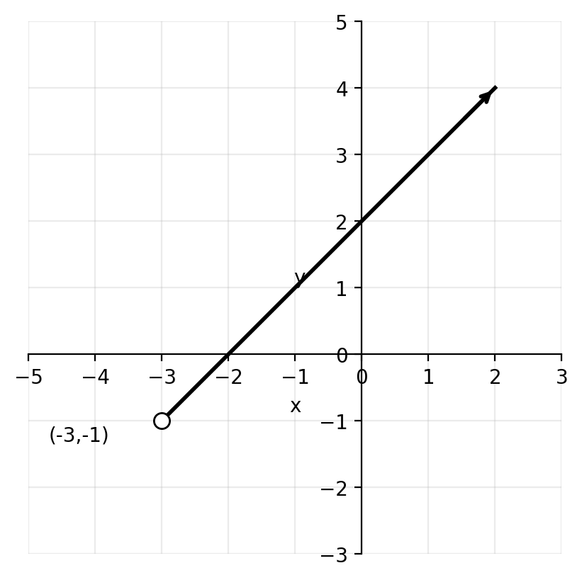
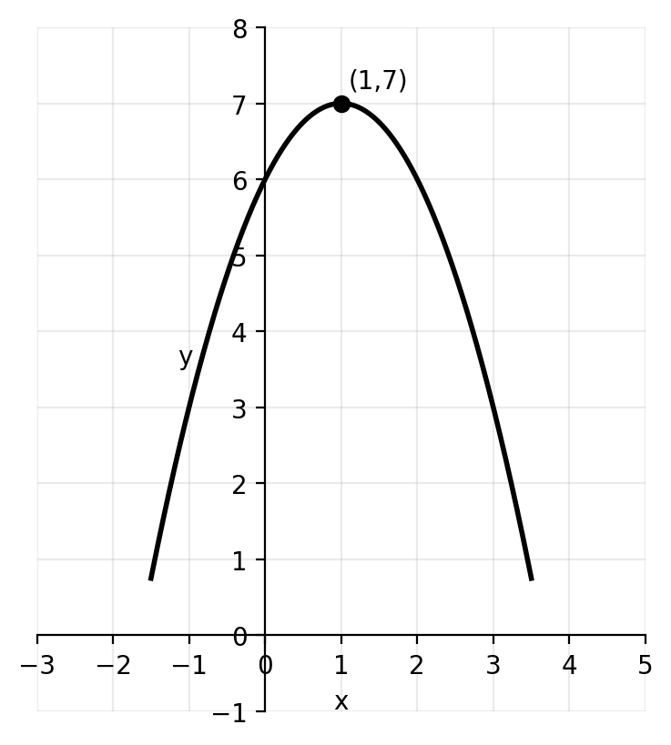
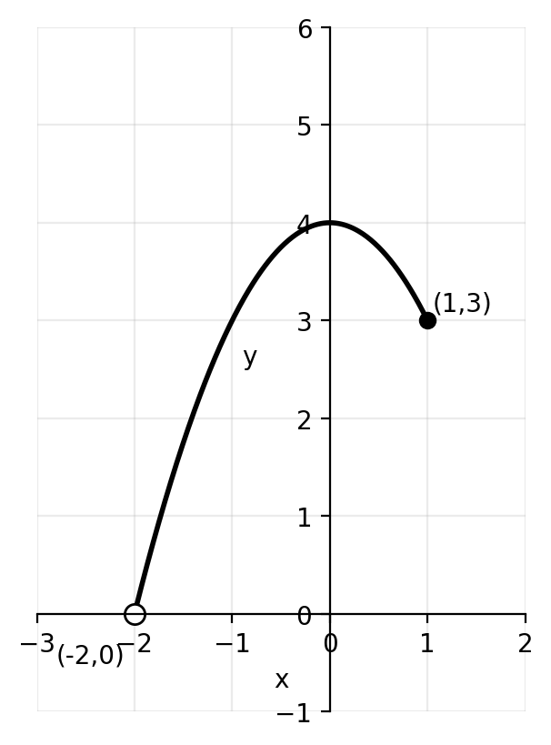
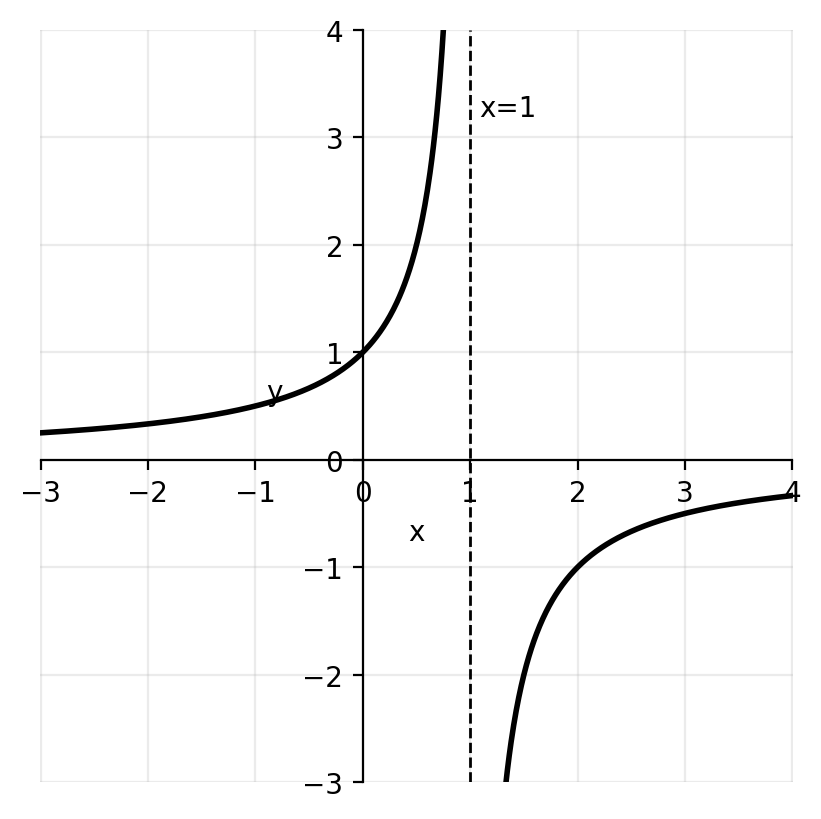
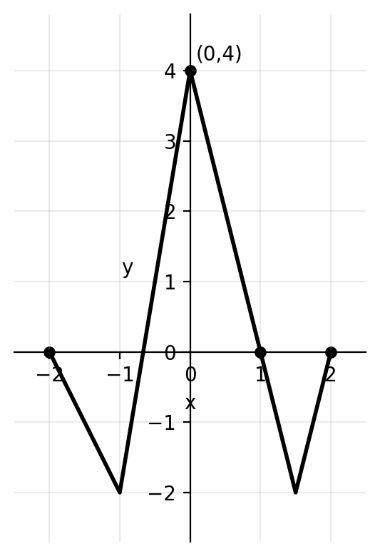
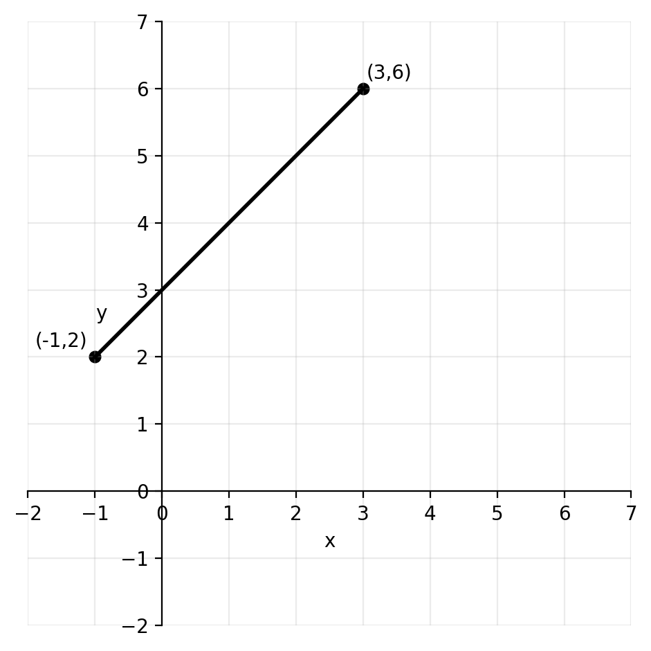
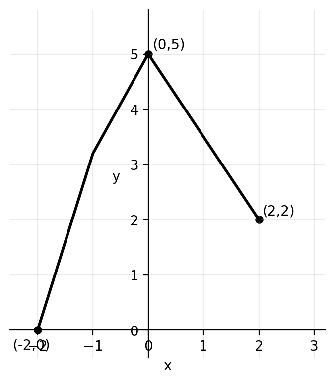
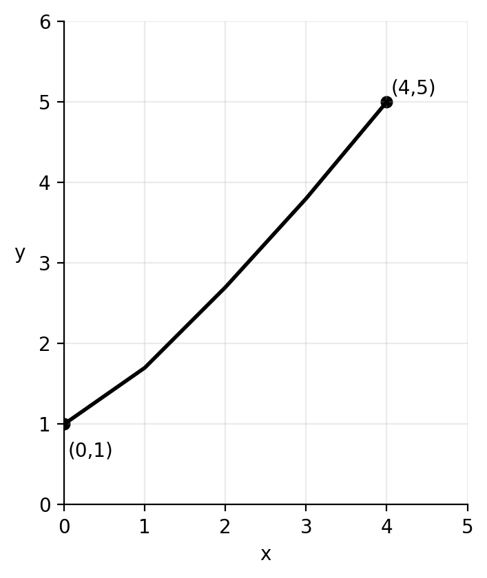

# Functions — Test (G10 / IB Criterion A)

**Name:** ____________________  **Class:** _______  **Date:** __________  
**Time:** 60–75 minutes (teacher choice)  
**Calculator:** Allowed

---

## Instructions
- Answer all questions.
- Show full working where appropriate.
- Leave exact answers unless told to round.
- Use correct mathematical notation.
- Keep your work organized using the question numbers.

---

## Quick formulas
- For \(y = \sqrt{\text{expression}}\), require \(\text{expression} \geq 0\)
- For \(y = \dfrac{1}{\text{expression}}\), require \(\text{expression} \neq 0\)
- For \(y = \dfrac{1}{\sqrt{\text{expression}}}\), require \(\text{expression} > 0\)
- For \(y = \log_a(\text{expression})\), require \(\text{expression} > 0\)
- A function has an inverse only if it is one-to-one on its stated domain

---

## Part A — Practice-Based Questions

### Questions 1–15
These questions are based on the attached practice test, with changed numbers and slightly increased difficulty.

---

**1.** Write down the domain and range of each graph.

**(a)**

{ width=45% }

The graph is a ray starting at the open point \((-3,-1)\) and going up to the right.

**(b)**

{ width=45% }

The graph is a downward-opening parabola with maximum point \((1,7)\).

**(c)**

{ width=45% }

The curve begins at the open point \((-2,0)\) and ends at the closed point \((1,3)\).

**(d)**

{ width=45% }

The graph has a vertical asymptote at \(x=1\) and a horizontal asymptote at \(y=0\).

---

**2.** Find the largest possible domain of each function.

**(a)** \( y = \sqrt{4x+5}-2 \)

**(b)** \( y = \dfrac{7x-1}{3-x} \)

**(c)** \( y = \dfrac{1}{\sqrt{5x-4}} \)

**(d)** \( y = \log_3(2x+7) \)

---

**3.** You are given the function
\[
f(x) = -x^4 + 2x^2 + 1
\]
defined for \( 0 \leq x \leq 2 \).

Write down the range of \( f \).

---

**4.** Given \( f(x)=2x \) and \( g(x)=3x-4 \), write down the values of:

**(a)** \( f \circ g(2) \)

**(b)** \( g \circ f(3) \)

**(c)** \( g \circ g(1) \)

**(d)** \( f \circ g \circ f(-2) \)

---

**5.** Given \( f(x)=4x-5 \) and \( g(x)=\dfrac{x}{4}+2 \), find in simplest form:

**(a)** \( f \circ g(x) \)

**(b)** \( g \circ f(x) \)

**(c)** \( f \circ f(x) \)

---

**6.** Given \( f(x)=x-4 \) and \( g(x)=5x+10 \), find in the form \( ax+b \):

**(a)** \( f^{-1}(x) \)

**(b)** \( g^{-1}(x) \)

**(c)** \( f^{-1} \circ g^{-1}(x) \)

**(d)** \( g^{-1} \circ f^{-1}(x) \)

---

**7.** Consider the functions
\[
f(x)=2x^2-12x+23 \qquad \text{and} \qquad g(x)=x+1
\]

**(a)** Write down the largest possible domain and range of \( f(x) \).

**(b)** Let \( h(x)=f \circ g(x) \). Find an expression for \( h(x) \) in the form \( ax^2+bx+c \).

**(c)** Expand and simplify \( 2(x-5)^2+1 \).

**(d)** The domain of \( h(x) \) is now limited to \( x \geq a \) such that this function has an inverse. Write down the smallest possible value of \( a \).

**(e)** For the value of \( a \) found in part (d), find an expression for \( h^{-1}(x) \).

---

**8.** Let \( f(x)=3x+1 \). The graph of \( g(x) \) is shown below.

{ width=45% }

From the graph, \( g(0)=4 \), \( g(1)=0 \), and \( g(-2)=0 \).

Write down the value of:

**(a)** \( f \circ g(0) \)

**(b)** \( \sqrt{g \circ f(-1)} \)

---

**9.** The function \( p(x)=x^2-6x+8 \) is defined for \( x \geq 3 \).

**(a)** Explain why this restriction allows \( p \) to have an inverse.

**(b)** Find \( p^{-1}(x) \).

**(c)** State the domain of \( p^{-1}(x) \).

---

**10.** Consider \( f(x)=\sqrt{2x-1} \).

**(a)** Find the largest possible domain of \( f \).

**(b)** Write down the range of \( f \).

**(c)** Explain why \( f \) has an inverse.

**(d)** Find \( f^{-1}(x) \).

---

**11.** Given \( f(x)=x^2+2 \) and \( g(x)=2x-1 \), find:

**(a)** \( f \circ g(x) \)

**(b)** \( g \circ f(x) \)

**(c)** \( f \circ g(3) \)

**(d)** \( g \circ f(-2) \)

---

**12.** For the function
\[
q(x)=\frac{x+2}{x-3}
\]

**(a)** State the largest possible domain.

**(b)** Find the value of \( q(5) \).

**(c)** Find \( q^{-1}(x) \).

**(d)** State the value that is not in the range of \( q \).

---

**13.** A function is defined by
\[
r(x)=
\begin{cases}
x+2 & \text{for } -3 \leq x < 1 \\
5-x & \text{for } 1 \leq x \leq 4
\end{cases}
\]

Write down:

**(a)** the domain of \( r \)

**(b)** the range of \( r \)

**(c)** whether \( r \) has an inverse on this whole domain, with a reason

---

**14.** Solve each equation.

**(a)** \( f(x)=11 \) for \( f(x)=3x-4 \)

**(b)** \( f^{-1}(x)=5 \) for \( f(x)=2x+1 \)

**(c)** \( f(f(x))=19 \) for \( f(x)=2x+3 \)

---

**15.** On the grid below, sketch the graph of \( y=f^{-1}(x) \) if the graph of \( y=f(x) \) is the line segment from \( (-1,2) \) to \( (3,6) \).

Also state the domain and range of \( f^{-1} \).

{ width=45% }

---

## Part B — IB Criterion A Unfamiliar Questions

### Questions 16–30
These questions are unfamiliar but solvable using the same ideas.

---

**16.** A student says:

“If \( f \circ g(x)=g \circ f(x) \) for one value of \( x \), then the two composite functions must be equal for all \( x \).”

Use
\[
f(x)=2x+1 \qquad \text{and} \qquad g(x)=x^2
\]
to decide whether the statement is true or false.

You must:
- find \( f \circ g(x) \)
- find \( g \circ f(x) \)
- solve \( f \circ g(x)=g \circ f(x) \)
- make a conclusion

---

**17.** Let
\[
f(x)=\sqrt{x+4} \qquad \text{and} \qquad g(x)=x^2-8
\]

**(a)** Find \( f \circ g(x) \).

**(b)** Find the largest possible domain of \( f \circ g \).

**(c)** Explain why the domain is not simply the domain of \( f \).

---

**18.** The function
\[
h(x)=\frac{3x-2}{x+4}
\]
is defined for \( x \neq -4 \).

**(a)** Find \( h^{-1}(x) \).

**(b)** Show that \( h \circ h^{-1}(x)=x \).

**(c)** State the value not included in the range of \( h \).

---

**19.** The function
\[
f(x)=x^2-10x+30
\]
is defined for \( x \geq 5 \).

**(a)** Write \( f(x) \) in completed-square form.

**(b)** Find \( f^{-1}(x) \).

**(c)** State the domain of \( f^{-1}(x) \).

**(d)** Explain what changes in the inverse if the original domain were \( x \leq 5 \) instead.

---

**20.** Consider the graph of \( y=g(x) \).

{ width=45% }

The closed points shown are \( (-2,0) \), \( (0,5) \), and \( (2,2) \).

**(a)** State the domain and range of \( g \).

**(b)** Is \( g \) one-to-one on the interval shown? Give a reason.

**(c)** Explain why \( g^{-1} \) does or does not exist as a function on this whole domain.

---

**21.** Let
\[
f(x)=ax+b
\]
where \( a \) and \( b \) are constants.

Given that \( f(3)=11 \) and \( f^{-1}(7)=1 \), find \( a \) and \( b \).

---

**22.** A student writes:
\[
\left( f \circ g \right)^{-1}(x)=f^{-1}(x)\circ g^{-1}(x)
\]

Use
\[
f(x)=x+2 \qquad \text{and} \qquad g(x)=3x
\]
to test this claim.

You must:
- find \( f \circ g(x) \)
- find \( \left( f \circ g \right)^{-1}(x) \)
- find \( f^{-1}(x)\circ g^{-1}(x) \)
- state the correct general order for inverses of composite functions

---

**23.** Solve for \( x \):
\[
f^{-1}(x)=g(x)
\]
where
\[
f(x)=2x-3 \qquad \text{and} \qquad g(x)=x+1
\]

---

**24.** Let
\[
m(x)=\frac{1}{\sqrt{x^2-16}}
\]

**(a)** Find the largest possible domain of \( m \).

**(b)** Explain why \( x \neq \pm 4 \) is not a complete domain statement.

**(c)** Give one value of \( x \) that satisfies \( x \neq \pm 4 \) but is still not allowed.

---

**25.** The graph of \( y=f(x) \) is shown below.

{ width=45% }

The graph is a one-to-one curve from \( (0,1) \) to \( (4,5) \).

**(a)** Write down the domain and range of \( f \).

**(b)** Write down the coordinates of two points on \( f^{-1} \).

**(c)** State the domain and range of \( f^{-1} \).

**(d)** Explain how the graph of \( f^{-1} \) is related to the graph of \( f \).

---

**26.** Let
\[
f(x)=3x-7
\]

Find the value of \( x \) such that
\[
f^{-1}(x)=f(x)
\]

---

**27.** Consider
\[
f(x)=|x-2|
\]

**(a)** Explain why \( f \) does not have an inverse on its largest possible domain.

**(b)** State a restriction on the domain that would allow an inverse to exist.

**(c)** For your chosen restriction, find the inverse.

---

**28.** Let
\[
f(x)=x^2+4x+7
\qquad \text{and} \qquad
g(x)=x-2
\]

**(a)** Find \( f \circ g(x) \).

**(b)** Write your answer in completed-square form.

**(c)** State the smallest value \( a \) such that restricting the domain to \( x \geq a \) makes the composite function invertible.

**(d)** Find the inverse for that restricted domain.

---

**29.** A student claims that for
\[
f(x)=4x+1
\]
the inverse is
\[
f^{-1}(x)=\frac{1}{4x+1}
\]

**(a)** Explain why this is incorrect.

**(b)** Find the correct inverse.

**(c)** Use a specific input value to check that your inverse works.

---

**30.** A machine applies two operations in order:
- first multiply the input by \( 2 \)
- then subtract \( 5 \)

A second machine applies:
- first square the input
- then add \( 1 \)

Let the first machine be \( f \) and the second machine be \( g \).

**(a)** Write expressions for \( f(x) \) and \( g(x) \).

**(b)** Find \( f \circ g(x) \).

**(c)** Find \( g \circ f(x) \).

**(d)** Explain in words why these two composite functions are different.

---

# Answer Key

## Part A

**1.**

**(a)**  \(D: x>-3\), \(R: y>-1\)

**(b)**  \(D: x \in \mathbb{R}\), \(R: y \leq 7\)

**(c)**  \(D: -2<x\leq 1\), \(R: 0<y\leq 3\)

**(d)**  \(D: x \neq 1\), \(R: y \neq 0\)

---

**2.**

**(a)**
\[
4x+5 \geq 0 \Rightarrow x \geq -\frac{5}{4}
\]

**(b)**
\[
3-x \neq 0 \Rightarrow x \neq 3
\]

**(c)**
\[
5x-4>0 \Rightarrow x>\frac{4}{5}
\]

**(d)**
\[
2x+7>0 \Rightarrow x>-\frac{7}{2}
\]

---

**3.**
\[
f(0)=1, \quad f(2)=-7
\]
\[
f'(x)=-4x^3+4x=4x(1-x^2)
\]
Critical value in the interval: \(x=1\)
\[
f(1)=2
\]
So the range is
\[
-7 \leq f(x) \leq 2
\]

---

**4.**

**(a)**  \(g(2)=2\), so \(f(g(2))=f(2)=4\)

**(b)**  \(f(3)=6\), so \(g(f(3))=g(6)=14\)

**(c)**  \(g(1)=-1\), then \(g(-1)=-7\)

**(d)**  \(f(-2)=-4\), then \(g(-4)=-16\), then \(f(-16)=-32\)

---

**5.**

**(a)**
\[
f \circ g(x)=4\left(\frac{x}{4}+2\right)-5=x+3
\]

**(b)**
\[
g \circ f(x)=\frac{4x-5}{4}+2=x+\frac{3}{4}
\]

**(c)**
\[
f \circ f(x)=4(4x-5)-5=16x-25
\]

---

**6.**

**(a)**  \(f^{-1}(x)=x+4\)

**(b)**  \(g^{-1}(x)=\dfrac{x}{5}-2\)

**(c)**
\[
f^{-1} \circ g^{-1}(x)=\frac{x}{5}+2
\]

**(d)**
\[
g^{-1} \circ f^{-1}(x)=\frac{x-6}{5}
\]

---

**7.**

**(a)**
\[
f(x)=2x^2-12x+23=2(x-3)^2+5
\]
Largest domain: \(x \in \mathbb{R}\)
\[
R: f(x) \geq 5
\]

**(b)**
\[
h(x)=f(x+1)=2(x+1)^2-12(x+1)+23=2x^2-8x+13
\]

**(c)**
\[
2(x-5)^2+1=2x^2-20x+51
\]

**(d)**
\[
h(x)=2x^2-8x+13=2(x-2)^2+5
\]
So \(a=2\).

**(e)**
\[
y=2(x-2)^2+5
\]
\[
y-5=2(x-2)^2
\]
Since \(x \geq 2\),
\[
x=2+\sqrt{\frac{y-5}{2}}
\]
Therefore
\[
h^{-1}(x)=2+\sqrt{\frac{x-5}{2}}
\]

---

**8.**

**(a)**
\[
f \circ g(0)=f(4)=13
\]

**(b)**
\[
f(-1)=-2, \quad g(-2)=0, \quad \sqrt{g \circ f(-1)}=0
\]

---

**9.**

**(a)** On \(x \geq 3\), the parabola is one-to-one.

**(b)**
\[
p(x)=x^2-6x+8=(x-3)^2-1
\]
\[
y+1=(x-3)^2
\]
Since \(x \geq 3\),
\[
x=3+\sqrt{y+1}
\]
So
\[
p^{-1}(x)=3+\sqrt{x+1}
\]

**(c)**  Domain of \(p^{-1}\): \(x \geq -1\)

---

**10.**

**(a)**
\[
2x-1 \geq 0 \Rightarrow x \geq \frac{1}{2}
\]

**(b)**  \(y \geq 0\)

**(c)** It is increasing on its domain, so it is one-to-one.

**(d)**
\[
y=\sqrt{2x-1}
\]
\[
y^2=2x-1
\]
\[
x=\frac{y^2+1}{2}
\]
Therefore
\[
f^{-1}(x)=\frac{x^2+1}{2}
\]

---

**11.**

**(a)**
\[
f \circ g(x)=(2x-1)^2+2=4x^2-4x+3
\]

**(b)**
\[
g \circ f(x)=2(x^2+2)-1=2x^2+3
\]

**(c)**  \(g(3)=5\), so \(f(5)=27\)

**(d)**  \(f(-2)=6\), so \(g(6)=11\)

---

**12.**

**(a)**  \(x \neq 3\)

**(b)**
\[
q(5)=\frac{5+2}{5-3}=\frac{7}{2}
\]

**(c)**
\[
y=\frac{x+2}{x-3}
\]
\[
y(x-3)=x+2
\]
\[
yx-3y=x+2
\]
\[
x(y-1)=3y+2
\]
\[
x=\frac{3y+2}{y-1}
\]
So
\[
q^{-1}(x)=\frac{3x+2}{x-1}
\]

**(d)**  \(y \neq 1\)

---

**13.**

**(a)**  \(-3 \leq x \leq 4\)

**(b)**  First part gives \(-1 \leq y < 3\). Second part gives \(1 \leq y \leq 4\). Overall range: \(-1 \leq y \leq 4\)

**(c)**  No. It is not one-to-one on the whole domain, so it does not have an inverse there.

---

**14.**

**(a)**
\[
3x-4=11 \Rightarrow x=5
\]

**(b)**  If \(f^{-1}(x)=5\), then \(x=f(5)=11\)

**(c)**
\[
f(f(x))=2(2x+3)+3=4x+9
\]
\[
4x+9=19 \Rightarrow x=\frac{5}{2}
\]

---

**15.**  Endpoints swap:
\[
(-1,2) \mapsto (2,-1), \qquad (3,6) \mapsto (6,3)
\]
So \(y=f^{-1}(x)\) is the line segment from \((2,-1)\) to \((6,3)\).

Domain of \(f^{-1}\): \(2 \leq x \leq 6\)

Range of \(f^{-1}\): \(-1 \leq y \leq 3\)

---

## Part B

**16.**
\[
f \circ g(x)=2x^2+1
\]
\[
g \circ f(x)=(2x+1)^2=4x^2+4x+1
\]
Set them equal:
\[
2x^2+1=4x^2+4x+1
\]
\[
0=2x^2+4x=2x(x+2)
\]
\[
x=0 \text{ or } x=-2
\]
They are equal for some values, but not for all values. The statement is false.

---

**17.**

**(a)**
\[
f \circ g(x)=\sqrt{(x^2-8)+4}=\sqrt{x^2-4}
\]

**(b)**
\[
x^2-4 \geq 0
\]
\[
x \leq -2 \quad \text{or} \quad x \geq 2
\]

**(c)** The output of \(g\) becomes the input of \(f\), so the restriction must be applied after substitution.

---

**18.**

**(a)**
\[
y=\frac{3x-2}{x+4}
\]
\[
yx+4y=3x-2
\]
\[
x(y-3)=-(2+4y)
\]
\[
x=\frac{2+4y}{3-y}
\]
So
\[
h^{-1}(x)=\frac{2+4x}{3-x}
\]

**(b)** Substituting \(h^{-1}(x)\) into \(h\) simplifies to \(x\).

**(c)**  The range excludes \(y=3\).

---

**19.**

**(a)**
\[
f(x)=x^2-10x+30=(x-5)^2+5
\]

**(b)**
\[
y=(x-5)^2+5
\]
Since \(x \geq 5\),
\[
x=5+\sqrt{y-5}
\]
So
\[
f^{-1}(x)=5+\sqrt{x-5}
\]

**(c)**  Domain of \(f^{-1}\): \(x \geq 5\)

**(d)**  If the original domain were \(x \leq 5\), the inverse would be
\[
f^{-1}(x)=5-\sqrt{x-5}
\]

---

**20.**

**(a)**  Domain: \(-2 \leq x \leq 2\), Range: \(0 \leq y \leq 5\)

**(b)**  No. Some horizontal lines meet the graph more than once.

**(c)**  Therefore \(g^{-1}\) does not exist as a function on this whole domain.

---

**21.**
From \(f(3)=11\):
\[
3a+b=11
\]
From \(f^{-1}(7)=1\), we know \(f(1)=7\):
\[
a+b=7
\]
Subtracting gives
\[
2a=4 \Rightarrow a=2
\]
Then
\[
b=5
\]

---

**22.**
\[
f \circ g(x)=f(3x)=3x+2
\]
So
\[
(f \circ g)^{-1}(x)=\frac{x-2}{3}
\]
Also
\[
f^{-1}(x)=x-2, \qquad g^{-1}(x)=\frac{x}{3}
\]
Then
\[
f^{-1} \circ g^{-1}(x)=\frac{x}{3}-2
\]
These are not equal, so the claim is false.

Correct general rule:
\[
(f \circ g)^{-1}=g^{-1} \circ f^{-1}
\]

---

**23.**
First,
\[
f^{-1}(x)=\frac{x+3}{2}
\]
Now solve
\[
\frac{x+3}{2}=x+1
\]
\[
x+3=2x+2
\]
\[
x=1
\]

---

**24.**

**(a)**
\[
x^2-16>0
\]
\[
x<-4 \quad \text{or} \quad x>4
\]

**(b)**  The statement \(x \neq \pm 4\) excludes only the boundary values, but not values making the expression inside the square root negative.

**(c)**  One example is \(x=0\).

---

**25.**

**(a)**  Domain: \(0 \leq x \leq 4\), Range: \(1 \leq y \leq 5\)

**(b)**  Two points on \(f^{-1}\) are \((1,0)\) and \((5,4)\)

**(c)**  Domain of \(f^{-1}\): \(1 \leq x \leq 5\), Range of \(f^{-1}\): \(0 \leq y \leq 4\)

**(d)**  The graph of \(f^{-1}\) is the reflection of the graph of \(f\) in the line \(y=x\).

---

**26.**
\[
f^{-1}(x)=\frac{x+7}{3}
\]
Set equal:
\[
3x-7=\frac{x+7}{3}
\]
\[
9x-21=x+7
\]
\[
8x=28
\]
\[
x=\frac{7}{2}
\]

---

**27.**

**(a)**  It is not one-to-one on all real numbers.

**(b)**  One valid restriction is \(x \geq 2\).

**(c)**  For \(x \geq 2\),
\[
f(x)=x-2
\]
so
\[
f^{-1}(x)=x+2
\]
with domain \(x \geq 0\).

---

**28.**

**(a)**
\[
f \circ g(x)=f(x-2)=(x-2)^2+4(x-2)+7=x^2+3
\]

**(b)**
\[
x^2+3=(x-0)^2+3
\]

**(c)**  The smallest value is \(a=0\).

**(d)**
\[
y=x^2+3
\]
For \(x \geq 0\),
\[
x=\sqrt{y-3}
\]
So
\[
(f \circ g)^{-1}(x)=\sqrt{x-3}
\]

---

**29.**

**(a)**  \(\dfrac{1}{4x+1}\) is the reciprocal of \(f(x)\), not the inverse function.

**(b)**
\[
f^{-1}(x)=\frac{x-1}{4}
\]

**(c)**  For example, \(f(3)=13\) and \(f^{-1}(13)=3\).

---

**30.**

**(a)**
\[
f(x)=2x-5, \qquad g(x)=x^2+1
\]

**(b)**
\[
f \circ g(x)=2(x^2+1)-5=2x^2-3
\]

**(c)**
\[
g \circ f(x)=(2x-5)^2+1=4x^2-20x+26
\]

**(d)**  Composition depends on order, so changing the order changes the output expression.

---

End of test.
