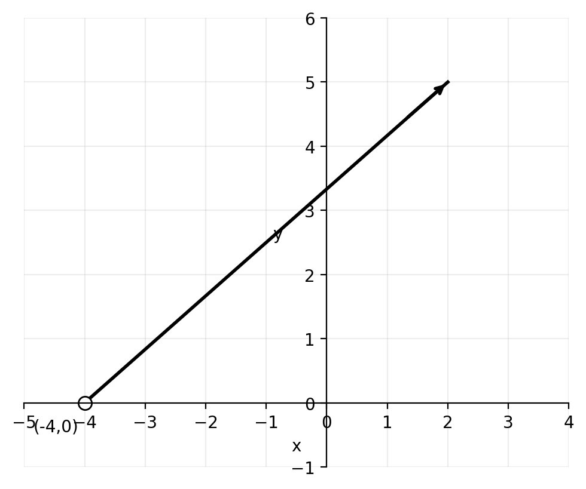
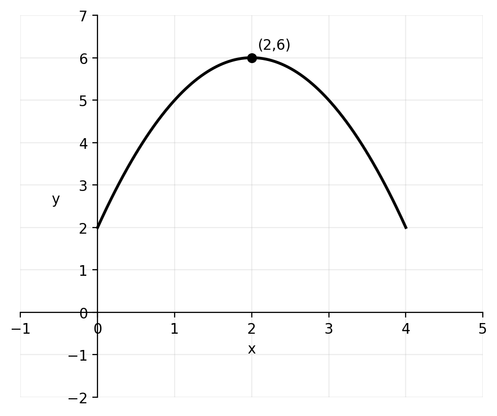
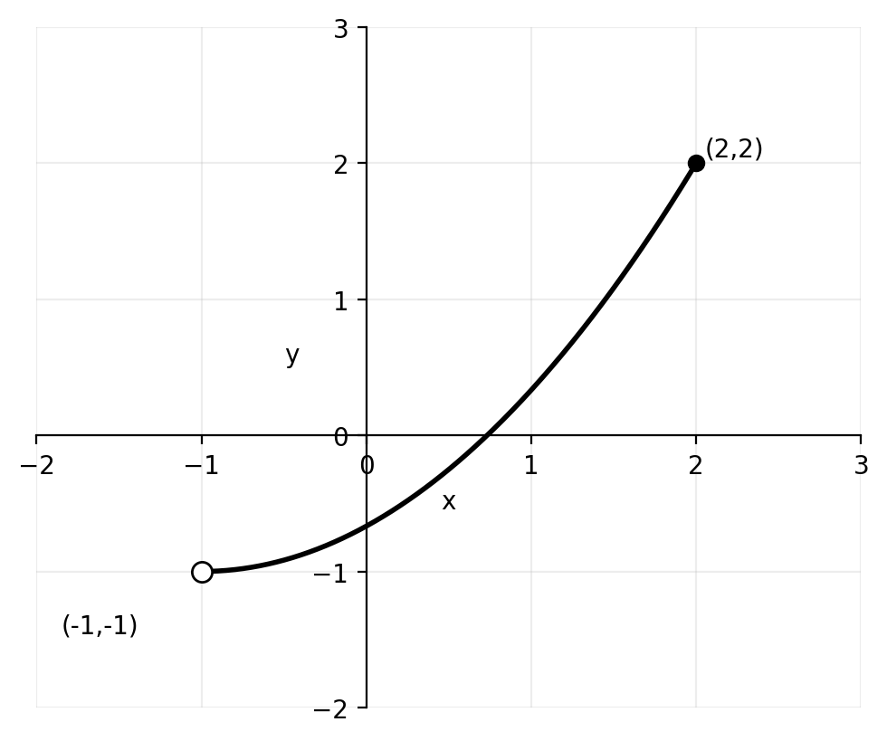
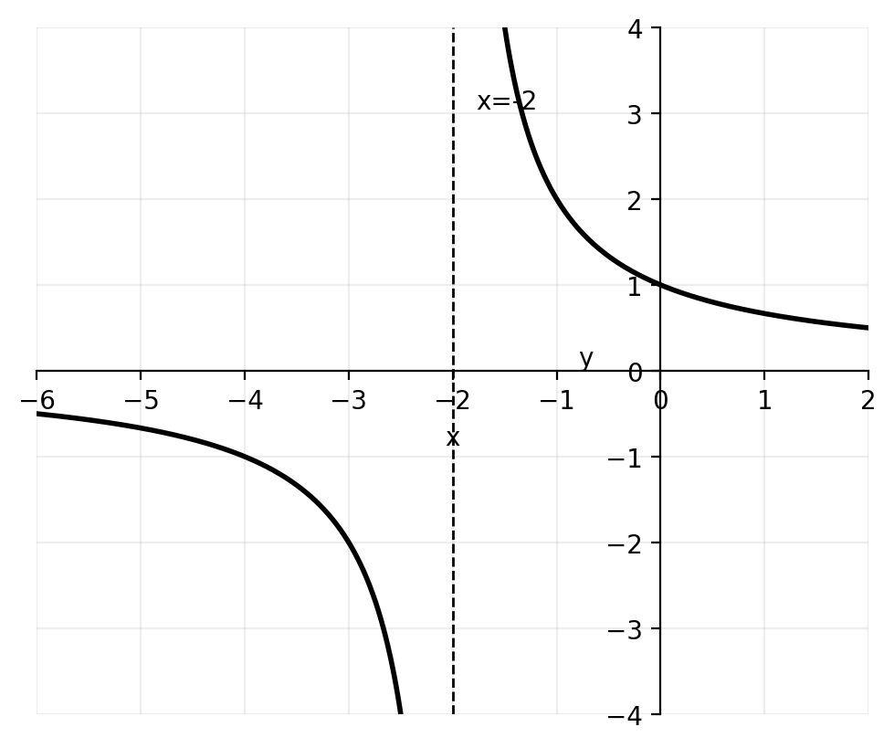
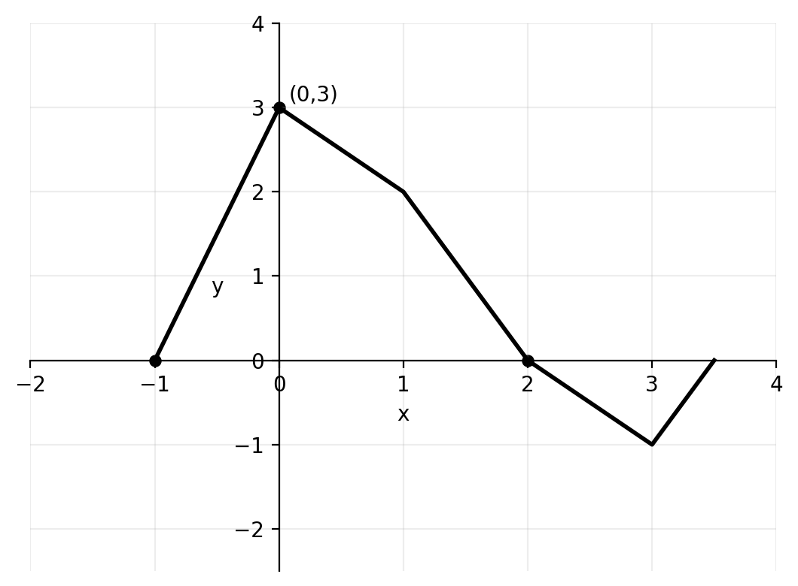
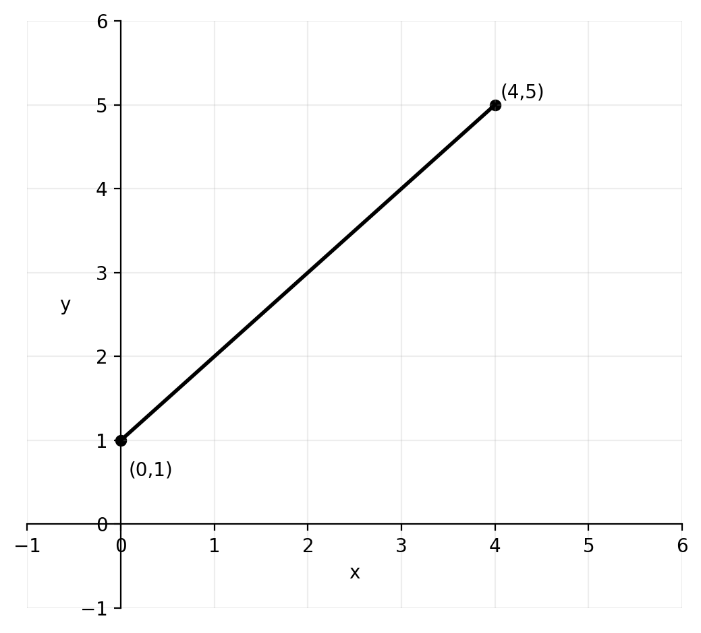
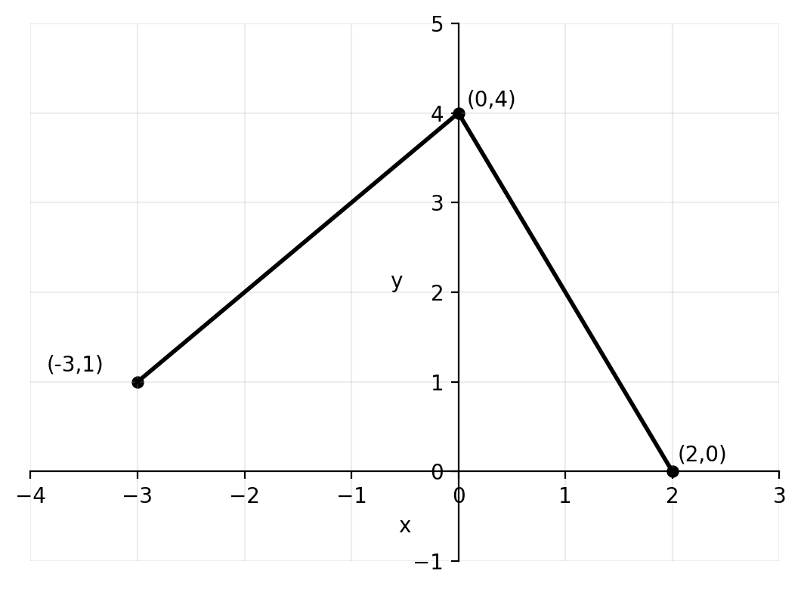
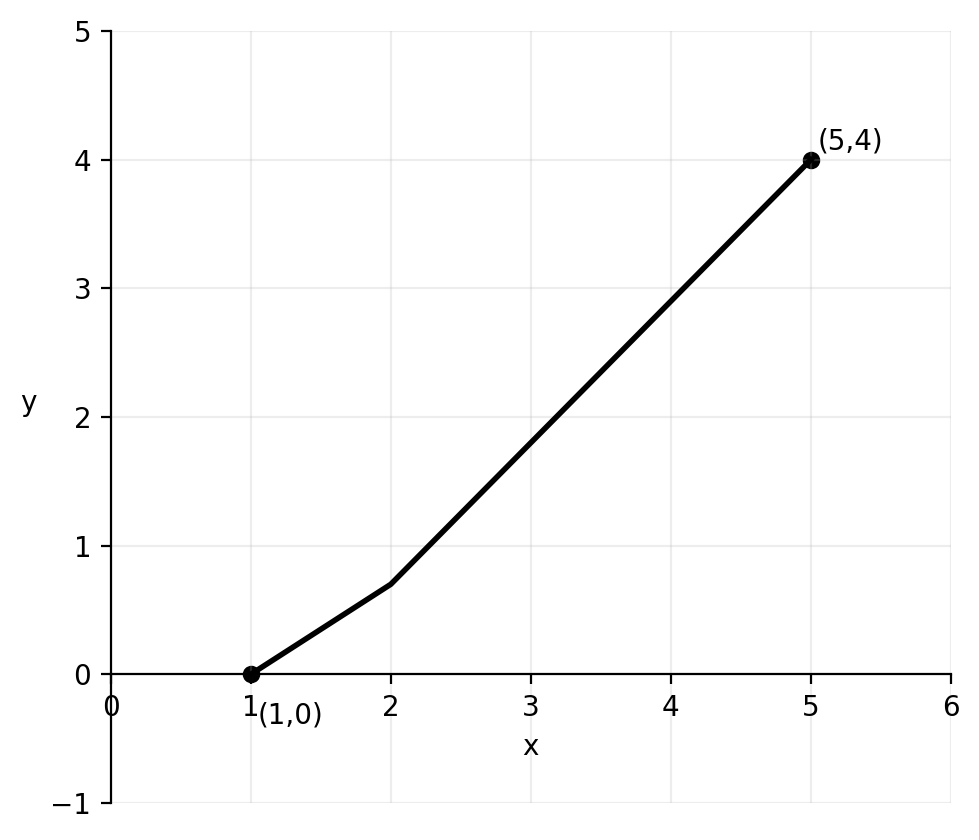

# Functions — Test (G10 / IB Criterion A)

**Name:** ____________________  **Class:** _______  **Date:** __________  
**Time:** 60–75 minutes (teacher choice)  
**Calculator:** Allowed

---

## Instructions
- Answer all questions.
- Show full working where appropriate.
- Leave exact answers unless told to round.
- Use correct mathematical notation.
- Keep your work organized using the question numbers.

---

## Quick formulas
- For \(y = \sqrt{\text{expression}}\), require \(\text{expression} \geq 0\)
- For \(y = \dfrac{1}{\text{expression}}\), require \(\text{expression} \neq 0\)
- For \(y = \dfrac{1}{\sqrt{\text{expression}}}\), require \(\text{expression} > 0\)
- For \(y = \log_a(\text{expression})\), require \(\text{expression} > 0\)
- A function has an inverse only if it is one-to-one on its stated domain

---

## Part A — Practice-Based Questions

### Questions 1–15
These questions are based on the practice style, with changed numbers and slightly increased difficulty.

---

**1.** Write down the domain and range of each graph.

**(a)**

The graph is a ray starting at the open point \((-4,0)\) and going up to the right.

**(b)**

The graph is a downward-opening parabola with maximum point \((2,6)\).

**(c)**

The curve begins at the open point \((-1,-1)\) and ends at the closed point \((2,2)\).

**(d)**

The graph has a vertical asymptote at \(x=-2\) and a horizontal asymptote at \(y=0\).

---

**2.** Find the largest possible domain of each function.

**(a)** \( y = \sqrt{5x-2}+1 \)

**(b)** \( y = \dfrac{4x+9}{x-1} \)

**(c)** \( y = \dfrac{2}{\sqrt{3x+6}} \)

**(d)** \( y = \log_4(x-3) \)

---

**3.** You are given the function
\[
f(x) = -x^4 + 8x^2 - 5
\]
defined for \( 0 \leq x \leq 2 \).

Write down the range of \( f \).

---

**4.** Given \( f(x)=4x-1 \) and \( g(x)=2x+3 \), write down the values of:

**(a)** \( f \circ g(1) \)

**(b)** \( g \circ f(2) \)

**(c)** \( g \circ g(0) \)

**(d)** \( f \circ g \circ f(-1) \)

---

**5.** Given \( f(x)=3x+4 \) and \( g(x)=\dfrac{x}{3}-2 \), find in simplest form:

**(a)** \( f \circ g(x) \)

**(b)** \( g \circ f(x) \)

**(c)** \( f \circ f(x) \)

---

**6.** Given \( f(x)=x-9 \) and \( g(x)=6x+18 \), find in the form \( ax+b \):

**(a)** \( f^{-1}(x) \)

**(b)** \( g^{-1}(x) \)

**(c)** \( f^{-1} \circ g^{-1}(x) \)

**(d)** \( g^{-1} \circ f^{-1}(x) \)

---

**7.** Consider the functions
\[
f(x)=2x^2-16x+37 \qquad \text{and} \qquad g(x)=x-1
\]

**(a)** Write down the largest possible domain and range of \( f(x) \).

**(b)** Let \( h(x)=f \circ g(x) \). Find an expression for \( h(x) \) in the form \( ax^2+bx+c \).

**(c)** Expand and simplify \( 2(x-5)^2+5 \).

**(d)** The domain of \( h(x) \) is now limited to \( x \geq a \) such that this function has an inverse. Write down the smallest possible value of \( a \).

**(e)** For the value of \( a \) found in part (d), find an expression for \( h^{-1}(x) \).

---

**8.** Let \( f(x)=2x-1 \). The graph of \( g(x) \) is shown below.

From the graph, \( g(0)=3 \), \( g(2)=0 \), and \( g(-1)=0 \).

Write down the value of:

**(a)** \( f \circ g(0) \)

**(b)** \( \sqrt{g \circ f(0)} \)

---

**9.** The function \( p(x)=x^2-4x+1 \) is defined for \( x \geq 2 \).

**(a)** Explain why this restriction allows \( p \) to have an inverse.

**(b)** Find \( p^{-1}(x) \).

**(c)** State the domain of \( p^{-1}(x) \).

---

**10.** Consider \( f(x)=\sqrt{x+5} \).

**(a)** Find the largest possible domain of \( f \).

**(b)** Write down the range of \( f \).

**(c)** Explain why \( f \) has an inverse.

**(d)** Find \( f^{-1}(x) \).

---

**11.** Given \( f(x)=x^2+1 \) and \( g(x)=4x-3 \), find:

**(a)** \( f \circ g(x) \)

**(b)** \( g \circ f(x) \)

**(c)** \( f \circ g(2) \)

**(d)** \( g \circ f(-2) \)

---

**12.** For the function
\[
q(x)=\frac{x-2}{x+1}
\]

**(a)** State the largest possible domain.

**(b)** Find the value of \( q(3) \).

**(c)** Find \( q^{-1}(x) \).

**(d)** State the value that is not in the range of \( q \).

---

**13.** A function is defined by
\[
r(x)=
\begin{cases}
x+3 & \text{for } -4 \leq x < 0 \\
4-x & \text{for } 0 \leq x \leq 3
\end{cases}
\]

Write down:

**(a)** the domain of \( r \)

**(b)** the range of \( r \)

**(c)** whether \( r \) has an inverse on this whole domain, with a reason

---

**14.** Solve each equation.

**(a)** \( f(x)=18 \) for \( f(x)=5x-2 \)

**(b)** \( f^{-1}(x)=6 \) for \( f(x)=3x+1 \)

**(c)** \( f(f(x))=23 \) for \( f(x)=2x+4 \)

---

**15.** On the grid below, sketch the graph of \( y=f^{-1}(x) \) if the graph of \( y=f(x) \) is the line segment from \( (0,1) \) to \( (4,5) \).

Also state the domain and range of \( f^{-1} \).

---

## Part B — IB Criterion A Unfamiliar Questions

### Questions 16–30
These questions are unfamiliar but solvable using the same ideas.

---

**16.** A student says:

“If \( f \circ g(x)=g \circ f(x) \) for one value of \( x \), then the two composite functions must be equal for all \( x \).”

Use
\[
f(x)=x+3 \qquad \text{and} \qquad g(x)=x^2-1
\]
to decide whether the statement is true or false.

You must:
- find \( f \circ g(x) \)
- find \( g \circ f(x) \)
- solve \( f \circ g(x)=g \circ f(x) \)
- make a conclusion

---

**17.** Let
\[
f(x)=\sqrt{x+6} \qquad \text{and} \qquad g(x)=x^2-10
\]

**(a)** Find \( f \circ g(x) \).

**(b)** Find the largest possible domain of \( f \circ g \).

**(c)** Explain why the domain is not simply the domain of \( f \).

---

**18.** The function
\[
h(x)=\frac{4x-1}{x+2}
\]
is defined for \( x \neq -2 \).

**(a)** Find \( h^{-1}(x) \).

**(b)** Show that \( h \circ h^{-1}(x)=x \).

**(c)** State the value not included in the range of \( h \).

---

**19.** The function
\[
f(x)=x^2-8x+20
\]
is defined for \( x \geq 4 \).

**(a)** Write \( f(x) \) in completed-square form.

**(b)** Find \( f^{-1}(x) \).

**(c)** State the domain of \( f^{-1}(x) \).

**(d)** Explain what changes in the inverse if the original domain were \( x \leq 4 \) instead.

---

**20.** Consider the graph of \( y=g(x) \).

The closed points shown are \( (-3,1) \), \( (0,4) \), and \( (2,0) \).

**(a)** State the domain and range of \( g \).

**(b)** Is \( g \) one-to-one on the interval shown? Give a reason.

**(c)** Explain why \( g^{-1} \) does or does not exist as a function on this whole domain.

---

**21.** Let
\[
f(x)=ax+b
\]
where \( a \) and \( b \) are constants.

Given that \( f(5)=17 \) and \( f^{-1}(11)=2 \), find \( a \) and \( b \).

---

**22.** A student writes:
\[
\left( f \circ g \right)^{-1}(x)=f^{-1}(x)\circ g^{-1}(x)
\]

Use
\[
f(x)=x+5 \qquad \text{and} \qquad g(x)=4x
\]
to test this claim.

You must:
- find \( f \circ g(x) \)
- find \( \left( f \circ g \right)^{-1}(x) \)
- find \( f^{-1}(x)\circ g^{-1}(x) \)
- state the correct general order for inverses of composite functions

---

**23.** Solve for \( x \):
\[
f^{-1}(x)=g(x)
\]
where
\[
f(x)=3x-4 \qquad \text{and} \qquad g(x)=x+2
\]

---

**24.** Let
\[
m(x)=\frac{1}{\sqrt{x^2-9}}
\]

**(a)** Find the largest possible domain of \( m \).

**(b)** Explain why \( x \neq \pm 3 \) is not a complete domain statement.

**(c)** Give one value of \( x \) that satisfies \( x \neq \pm 3 \) but is still not allowed.

---

**25.** The graph of \( y=f(x) \) is shown below.

The graph is a one-to-one curve from \( (1,0) \) to \( (5,4) \).

**(a)** Write down the domain and range of \( f \).

**(b)** Write down the coordinates of two points on \( f^{-1} \).

**(c)** State the domain and range of \( f^{-1} \).

**(d)** Explain how the graph of \( f^{-1} \) is related to the graph of \( f \).

---

**26.** Let
\[
f(x)=5x-6
\]

Find the value of \( x \) such that
\[
f^{-1}(x)=f(x)
\]

---

**27.** Consider
\[
f(x)=|x-4|
\]

**(a)** Explain why \( f \) does not have an inverse on its largest possible domain.

**(b)** State a restriction on the domain that would allow an inverse to exist.

**(c)** For your chosen restriction, find the inverse.

---

**28.** Let
\[
f(x)=x^2+2x+5
\qquad \text{and} \qquad
g(x)=x-3
\]

**(a)** Find \( f \circ g(x) \).

**(b)** Write your answer in completed-square form.

**(c)** State the smallest value \( a \) such that restricting the domain to \( x \geq a \) makes the composite function invertible.

**(d)** Find the inverse for that restricted domain.

---

**29.** A student claims that for
\[
f(x)=7x+2
\]
the inverse is
\[
f^{-1}(x)=\frac{1}{7x+2}
\]

**(a)** Explain why this is incorrect.

**(b)** Find the correct inverse.

**(c)** Use a specific input value to check that your inverse works.

---

**30.** A machine applies two operations in order:
- first multiply the input by \( 2 \)
- then add \( 7 \)

A second machine applies:
- first square the input
- then subtract \( 3 \)

Let the first machine be \( f \) and the second machine be \( g \).

**(a)** Write expressions for \( f(x) \) and \( g(x) \).

**(b)** Find \( f \circ g(x) \).

**(c)** Find \( g \circ f(x) \).

**(d)** Explain in words why these two composite functions are different.

---

# Answer Key

## Part A

**1.**

**(a)**  \(D: x>-4\), \(R: y>0\)

**(b)**  \(D: x \in \mathbb{R}\), \(R: y \leq 6\)

**(c)**  \(D: -1<x\leq 2\), \(R: -1<y\leq 2\)

**(d)**  \(D: x \neq -2\), \(R: y \neq 0\)

---

**2.**

**(a)**
\[
5x-2 \geq 0 \Rightarrow x \geq \frac{2}{5}
\]

**(b)**
\[
x-1 \neq 0 \Rightarrow x \neq 1
\]

**(c)**
\[
3x+6>0 \Rightarrow x>-2
\]

**(d)**
\[
x-3>0 \Rightarrow x>3
\]

---

**3.**
\[
f(0)=-5, \quad f(2)=11
\]
\[
f'(x)=-4x^3+16x=-4x(x^2-4)
\]
On \(0<x<2\), \(f'(x)>0\), so the function is increasing on the interval.
Therefore the range is
\[
-5 \leq f(x) \leq 11
\]

---

**4.**

**(a)**  \(g(1)=5\), so \(f(g(1))=19\)

**(b)**  \(f(2)=7\), so \(g(f(2))=17\)

**(c)**  \(g(0)=3\), then \(g(3)=9\)

**(d)**  \(f(-1)=-5\), then \(g(-5)=-7\), then \(f(-7)=-29\)

---

**5.**

**(a)**
\[
f \circ g(x)=3\left(\frac{x}{3}-2\right)+4=x-2
\]

**(b)**
\[
g \circ f(x)=\frac{3x+4}{3}-2=x-\frac{2}{3}
\]

**(c)**
\[
f \circ f(x)=3(3x+4)+4=9x+16
\]

---

**6.**

**(a)**  \(f^{-1}(x)=x+9\)

**(b)**  \(g^{-1}(x)=\dfrac{x-18}{6}=\frac{x}{6}-3\)

**(c)**
\[
f^{-1} \circ g^{-1}(x)=\frac{x}{6}+6
\]

**(d)**
\[
g^{-1} \circ f^{-1}(x)=\frac{x-9}{6}+? 
\]
Correctly,
\[
g^{-1} \circ f^{-1}(x)=\frac{x+9}{6}-3=\frac{x-9}{6}
\]

---

**7.**

**(a)**
\[
f(x)=2x^2-16x+37=2(x-4)^2+5
\]
Largest domain: \(x \in \mathbb{R}\)
\[
R: f(x) \geq 5
\]

**(b)**
\[
h(x)=f(x-1)=2(x-1)^2-16(x-1)+37=2x^2-20x+55
\]

**(c)**
\[
2(x-5)^2+5=2x^2-20x+55
\]

**(d)**
\[
h(x)=2x^2-20x+55=2(x-5)^2+5
\]
So \(a=5\).

**(e)**
\[
y=2(x-5)^2+5
\]
\[
y-5=2(x-5)^2
\]
Since \(x \geq 5\),
\[
x=5+\sqrt{\frac{y-5}{2}}
\]
Therefore
\[
h^{-1}(x)=5+\sqrt{\frac{x-5}{2}}
\]

---

**8.**

**(a)**
\[
f \circ g(0)=f(3)=5
\]

**(b)**
\[
f(0)=-1, \quad g(-1)=0, \quad \sqrt{g \circ f(0)}=0
\]

---

**9.**

**(a)** On \(x \geq 2\), the parabola is one-to-one.

**(b)**
\[
p(x)=x^2-4x+1=(x-2)^2-3
\]
\[
y+3=(x-2)^2
\]
Since \(x \geq 2\),
\[
x=2+\sqrt{y+3}
\]
So
\[
p^{-1}(x)=2+\sqrt{x+3}
\]

**(c)**  Domain of \(p^{-1}\): \(x \geq -3\)

---

**10.**

**(a)**
\[
x+5 \geq 0 \Rightarrow x \geq -5
\]

**(b)**  \(y \geq 0\)

**(c)** It is increasing on its domain, so it is one-to-one.

**(d)**
\[
y=\sqrt{x+5}
\]
\[
y^2=x+5
\]
\[
x=y^2-5
\]
Therefore
\[
f^{-1}(x)=x^2-5
\]

---

**11.**

**(a)**
\[
f \circ g(x)=(4x-3)^2+1=16x^2-24x+10
\]

**(b)**
\[
g \circ f(x)=4(x^2+1)-3=4x^2+1
\]

**(c)**  \(g(2)=5\), so \(f(5)=26\)

**(d)**  \(f(-2)=5\), so \(g(5)=17\)

---

**12.**

**(a)**  \(x \neq -1\)

**(b)**
\[
q(3)=\frac{3-2}{3+1}=\frac{1}{4}
\]

**(c)**
\[
y=\frac{x-2}{x+1}
\]
\[
y(x+1)=x-2
\]
\[
yx+y=x-2
\]
\[
x(y-1)=-(y+2)
\]
\[
x=\frac{y+2}{1-y}
\]
So
\[
q^{-1}(x)=\frac{x+2}{1-x}
\]

**(d)**  \(y \neq 1\)

---

**13.**

**(a)**  \(-4 \leq x \leq 3\)

**(b)**  Overall range: \(-1 \leq y \leq 4\)

**(c)**  No. It is not one-to-one on the whole domain, so it does not have an inverse there.

---

**14.**

**(a)**
\[
5x-2=18 \Rightarrow x=4
\]

**(b)**  If \(f^{-1}(x)=6\), then \(x=f(6)=19\)

**(c)**
\[
f(f(x))=2(2x+4)+4=4x+12
\]
\[
4x+12=23 \Rightarrow x=\frac{11}{4}
\]

---

**15.**  Endpoints swap:
\[
(0,1) \mapsto (1,0), \qquad (4,5) \mapsto (5,4)
\]
So \(y=f^{-1}(x)\) is the line segment from \((1,0)\) to \((5,4)\).

Domain of \(f^{-1}\): \(1 \leq x \leq 5\)

Range of \(f^{-1}\): \(0 \leq y \leq 4\)

---

## Part B

**16.**
\[
f \circ g(x)=x^2+2
\]
\[
g \circ f(x)=(x+3)^2-1=x^2+6x+8
\]
Set them equal:
\[
x^2+2=x^2+6x+8
\]
\[
6x=-6
\]
\[
x=-1
\]
They are equal for one value, but not for all values. The statement is false.

---

**17.**

**(a)**
\[
f \circ g(x)=\sqrt{x^2-4}
\]

**(b)**
\[
x^2-4 \geq 0
\]
\[
x \leq -2 \quad \text{or} \quad x \geq 2
\]

**(c)** The output of \(g\) becomes the input of \(f\), so the restriction must be applied after substitution.

---

**18.**

**(a)**
\[
y=\frac{4x-1}{x+2}
\]
\[
yx+2y=4x-1
\]
\[
x(y-4)=-(1+2y)
\]
\[
x=\frac{1+2y}{4-y}
\]
So
\[
h^{-1}(x)=\frac{1+2x}{4-x}
\]

**(b)** Substituting \(h^{-1}(x)\) into \(h\) simplifies to \(x\).

**(c)**  The range excludes \(y=4\).

---

**19.**

**(a)**
\[
f(x)=x^2-8x+20=(x-4)^2+4
\]

**(b)**
\[
y=(x-4)^2+4
\]
Since \(x \geq 4\),
\[
x=4+\sqrt{y-4}
\]
So
\[
f^{-1}(x)=4+\sqrt{x-4}
\]

**(c)**  Domain of \(f^{-1}\): \(x \geq 4\)

**(d)**  If the original domain were \(x \leq 4\), the inverse would be
\[
f^{-1}(x)=4-\sqrt{x-4}
\]

---

**20.**

**(a)**  Domain: \(-3 \leq x \leq 2\), Range: \(0 \leq y \leq 4\)

**(b)**  No. Some horizontal lines meet the graph more than once.

**(c)**  Therefore \(g^{-1}\) does not exist as a function on this whole domain.

---

**21.**
From \(f(5)=17\):
\[
5a+b=17
\]
From \(f^{-1}(11)=2\), we know \(f(2)=11\):
\[
2a+b=11
\]
Subtracting gives
\[
3a=6 \Rightarrow a=2
\]
Then
\[
b=7
\]

---

**22.**
\[
f \circ g(x)=4x+5
\]
So
\[
(f \circ g)^{-1}(x)=\frac{x-5}{4}
\]
Also
\[
f^{-1}(x)=x-5, \qquad g^{-1}(x)=\frac{x}{4}
\]
Then
\[
f^{-1} \circ g^{-1}(x)=\frac{x}{4}-5
\]
These are not equal, so the claim is false.

Correct general rule:
\[
(f \circ g)^{-1}=g^{-1} \circ f^{-1}
\]

---

**23.**
First,
\[
f^{-1}(x)=\frac{x+4}{3}
\]
Now solve
\[
\frac{x+4}{3}=x+2
\]
\[
x+4=3x+6
\]
\[
-2=2x
\]
\[
x=-1
\]

---

**24.**

**(a)**
\[
x^2-9>0
\]
\[
x<-3 \quad \text{or} \quad x>3
\]

**(b)**  The statement \(x \neq \pm 3\) excludes only the boundary values, but not values making the expression inside the square root negative.

**(c)**  One example is \(x=0\).

---

**25.**

**(a)**  Domain: \(1 \leq x \leq 5\), Range: \(0 \leq y \leq 4\)

**(b)**  Two points on \(f^{-1}\) are \((0,1)\) and \((4,5)\)

**(c)**  Domain of \(f^{-1}\): \(0 \leq x \leq 4\), Range of \(f^{-1}\): \(1 \leq y \leq 5\)

**(d)**  The graph of \(f^{-1}\) is the reflection of the graph of \(f\) in the line \(y=x\).

---

**26.**
\[
f^{-1}(x)=\frac{x+6}{5}
\]
Set equal:
\[
5x-6=\frac{x+6}{5}
\]
\[
25x-30=x+6
\]
\[
24x=36
\]
\[
x=\frac{3}{2}
\]

---

**27.**

**(a)**  It is not one-to-one on all real numbers.

**(b)**  One valid restriction is \(x \geq 4\).

**(c)**  For \(x \geq 4\),
\[
f(x)=x-4
\]
so
\[
f^{-1}(x)=x+4
\]
with domain \(x \geq 0\).

---

**28.**

**(a)**
\[
f \circ g(x)=f(x-3)=(x-3)^2+2(x-3)+5=x^2-4x+8
\]

**(b)**
\[
x^2-4x+8=(x-2)^2+4
\]

**(c)**  The smallest value is \(a=2\).

**(d)**
\[
y=(x-2)^2+4
\]
For \(x \geq 2\),
\[
x=2+\sqrt{y-4}
\]
So
\[
(f \circ g)^{-1}(x)=2+\sqrt{x-4}
\]

---

**29.**

**(a)**  \(\dfrac{1}{7x+2}\) is the reciprocal of \(f(x)\), not the inverse function.

**(b)**
\[
f^{-1}(x)=\frac{x-2}{7}
\]

**(c)**  For example, \(f(5)=37\) and \(f^{-1}(37)=5\).

---

**30.**

**(a)**
\[
f(x)=2x+7, \qquad g(x)=x^2-3
\]

**(b)**
\[
f \circ g(x)=2(x^2-3)+7=2x^2+1
\]

**(c)**
\[
g \circ f(x)=(2x+7)^2-3=4x^2+28x+46
\]

**(d)**  Composition depends on order, so changing the order changes the output expression.

---

End of test.
