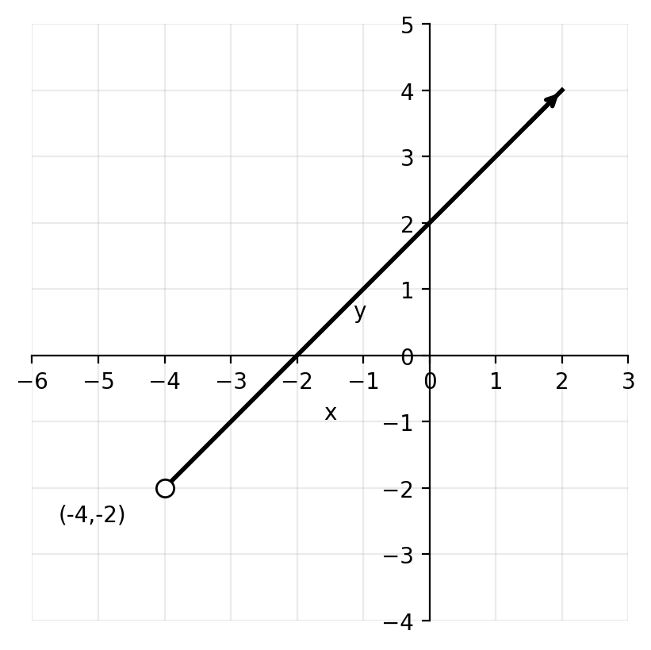
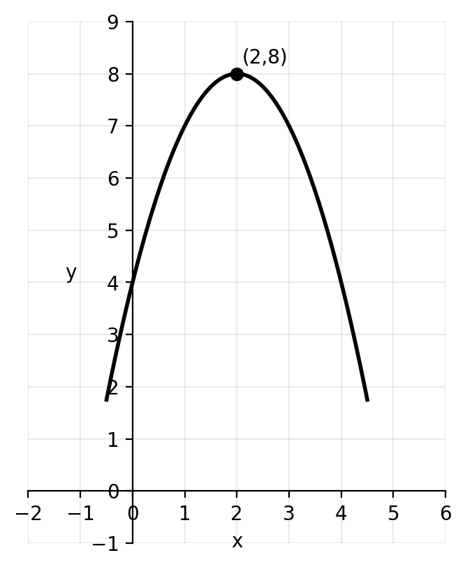
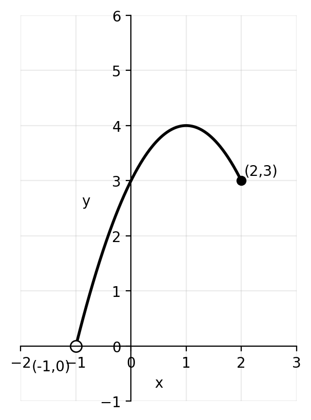
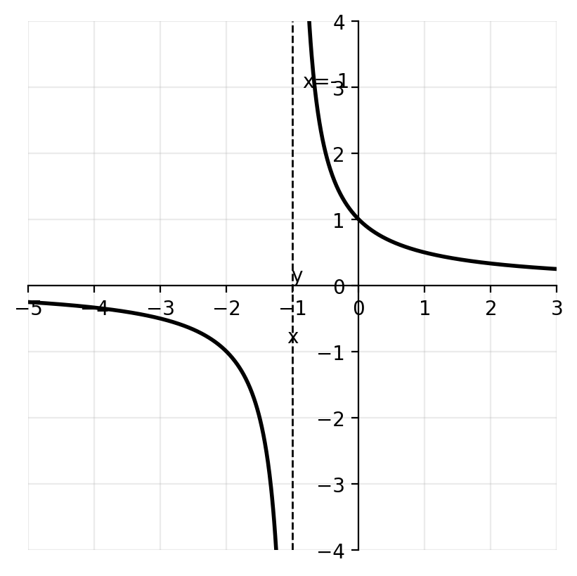
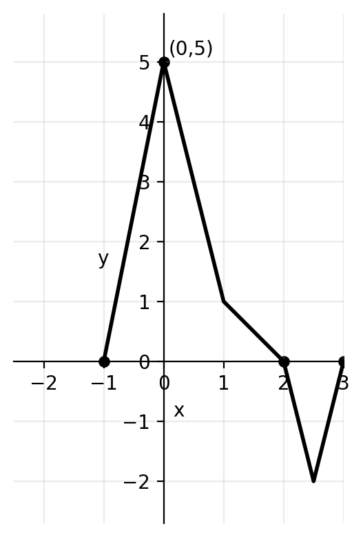

# Functions — Practice-Style 8 Questions

**Name:** ____________________  **Class:** _______  **Date:** __________  
**Time:** 20–30 minutes  
**Calculator:** Allowed

---

## Instructions
- Answer all questions.
- Show full working where appropriate.
- Leave exact answers unless told to round.
- Use correct mathematical notation.
- Keep your work organized using the question numbers.

---

## Quick formulas
- For \(y = \sqrt{\text{expression}}\), require \(\text{expression} \geq 0\)
- For \(y = \dfrac{1}{\text{expression}}\), require \(\text{expression} \neq 0\)
- For \(y = \dfrac{1}{\sqrt{\text{expression}}}\), require \(\text{expression} > 0\)
- A function has an inverse only if it is one-to-one on its stated domain

---

## Questions

**1.** Write down the domain and range of each graph.

**(a)**

The graph is a ray starting at the open point \((-4,-2)\) and going up to the right.

**(b)**

The graph is a downward-opening parabola with maximum point \((2,8)\).

**(c)**

The curve begins at the open point \((-1,0)\) and ends at the closed point \((2,3)\).

**(d)**

The graph has a vertical asymptote at \(x=-1\) and a horizontal asymptote at \(y=0\).

---

**2.** Find the largest possible domain of each function.

**(a)** \( y = \sqrt{5x-6}+3 \)

**(b)** \( y = \dfrac{4x+7}{x+2} \)

**(c)** \( y = \dfrac{2}{\sqrt{3x-1}} \)

**(d)** \( y = \log_2(x+9) \)

---

**3.** You are given the function
\[
f(x) = -x^4 + 6x^2 - 2
\]
defined for \( 0 \leq x \leq 2 \).

Write down the range of \( f \).

---

**4.** Given \( f(x)=3x \) and \( g(x)=2x-1 \), write down the values of:

**(a)** \( f \circ g(3) \)

**(b)** \( g \circ f(2) \)

**(c)** \( g \circ g(0) \)

**(d)** \( f \circ g \circ f(-1) \)

---

**5.** Given \( f(x)=6x-1 \) and \( g(x)=\dfrac{x}{6}+4 \), find in simplest form:

**(a)** \( f \circ g(x) \)

**(b)** \( g \circ f(x) \)

**(c)** \( f \circ f(x) \)

---

**6.** Given \( f(x)=x+5 \) and \( g(x)=4x-12 \), find in the form \( ax+b \):

**(a)** \( f^{-1}(x) \)

**(b)** \( g^{-1}(x) \)

**(c)** \( f^{-1} \circ g^{-1}(x) \)

**(d)** \( g^{-1} \circ f^{-1}(x) \)

---

**7.** Consider the functions
\[
f(x)=2x^2-16x+35 \qquad \text{and} \qquad g(x)=x-1
\]

**(a)** Write down the largest possible domain and range of \( f(x) \).

**(b)** Let \( h(x)=f \circ g(x) \). Find an expression for \( h(x) \) in the form \( ax^2+bx+c \).

**(c)** Expand and simplify \( 2(x-5)^2+3 \).

**(d)** The domain of \( h(x) \) is now limited to \( x \geq a \) such that this function has an inverse. Write down the smallest possible value of \( a \).

**(e)** For the value of \( a \) found in part (d), find an expression for \( h^{-1}(x) \).

---

**8.** Let \( f(x)=2x+5 \). The graph of \( g(x) \) is shown below.

From the graph, \( g(0)=5 \), \( g(2)=0 \), and \( g(-1)=0 \).

Write down the value of:

**(a)** \( f \circ g(0) \)

**(b)** \( \sqrt{g \circ f(-3)} \)

---

# Answer Key

**1.**

**(a)**  \(D: x>-4\), \(R: y>-2\)

**(b)**  \(D: x \in \mathbb{R}\), \(R: y \leq 8\)

**(c)**  \(D: -1<x\leq 2\), \(R: 0<y\leq 3\)

**(d)**  \(D: x \neq -1\), \(R: y \neq 0\)

---

**2.**

**(a)**
\[
5x-6 \geq 0 \Rightarrow x \geq \frac{6}{5}
\]

**(b)**
\[
x+2 \neq 0 \Rightarrow x \neq -2
\]

**(c)**
\[
3x-1>0 \Rightarrow x>\frac{1}{3}
\]

**(d)**
\[
x+9>0 \Rightarrow x>-9
\]

---

**3.**
\[
f(0)=-2, \quad f(2)=6
\]
\[
f'(x)=-4x^3+12x=-4x(x^2-3)
\]
Critical value in the interval: \(x=\sqrt{3}\)
\[
f(\sqrt{3})=7
\]
So the range is
\[
-2 \leq f(x) \leq 7
\]

---

**4.**

**(a)**  \(g(3)=5\), so \(f(g(3))=f(5)=15\)

**(b)**  \(f(2)=6\), so \(g(f(2))=g(6)=11\)

**(c)**  \(g(0)=-1\), then \(g(-1)=-3\)

**(d)**  \(f(-1)=-3\), then \(g(-3)=-7\), then \(f(-7)=-21\)

---

**5.**

**(a)**
\[
f \circ g(x)=6\left(\frac{x}{6}+4\right)-1=x+23
\]

**(b)**
\[
g \circ f(x)=\frac{6x-1}{6}+4=x+\frac{23}{6}
\]

**(c)**
\[
f \circ f(x)=6(6x-1)-1=36x-7
\]

---

**6.**

**(a)**  \(f^{-1}(x)=x-5\)

**(b)**  \(g^{-1}(x)=\dfrac{x+12}{4}=\dfrac{x}{4}+3\)

**(c)**
\[
f^{-1} \circ g^{-1}(x)=\frac{x}{4}-2
\]

**(d)**
\[
g^{-1} \circ f^{-1}(x)=\frac{x+7}{4}
\]

---

**7.**

**(a)**
\[
f(x)=2x^2-16x+35=2(x-4)^2+3
\]
Largest domain: \(x \in \mathbb{R}\)
\[
R: f(x) \geq 3
\]

**(b)**
\[
h(x)=f(x-1)=2(x-1)^2-16(x-1)+35=2x^2-20x+53
\]

**(c)**
\[
2(x-5)^2+3=2x^2-20x+53
\]

**(d)**
\[
h(x)=2x^2-20x+53=2(x-5)^2+3
\]
So \(a=5\).

**(e)**
\[
y=2(x-5)^2+3
\]
\[
y-3=2(x-5)^2
\]
Since \(x \geq 5\),
\[
x=5+\sqrt{\frac{y-3}{2}}
\]
Therefore
\[
h^{-1}(x)=5+\sqrt{\frac{x-3}{2}}
\]

---

**8.**

**(a)**
\[
f \circ g(0)=f(5)=15
\]

**(b)**
\[
f(-3)=-1, \quad g(-1)=0, \quad \sqrt{g \circ f(-3)}=0
\]
