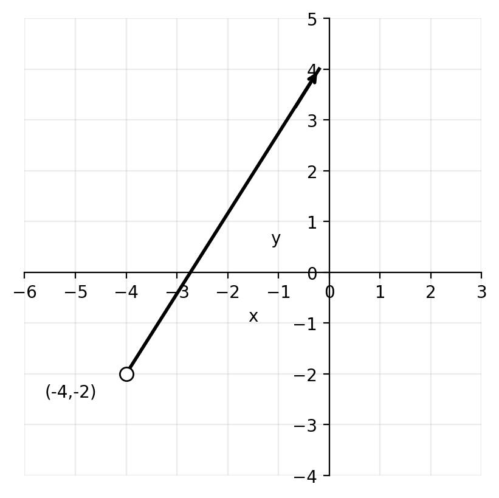
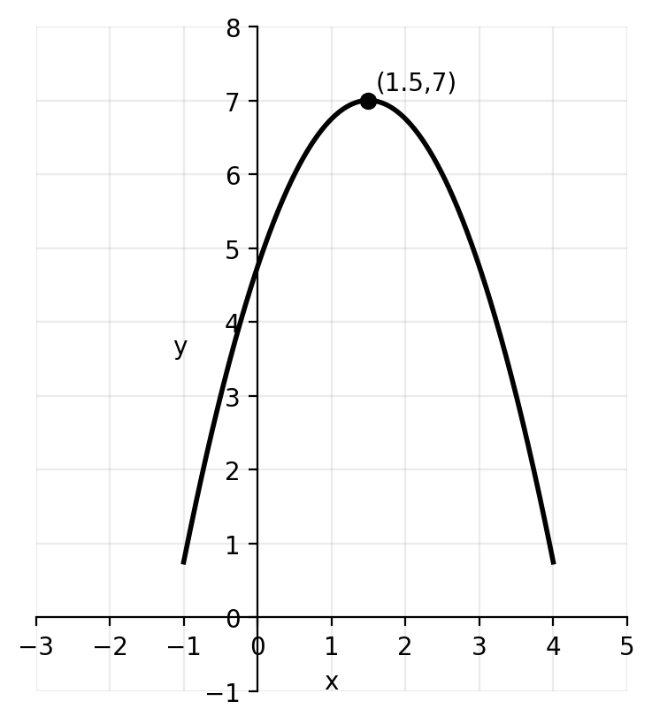
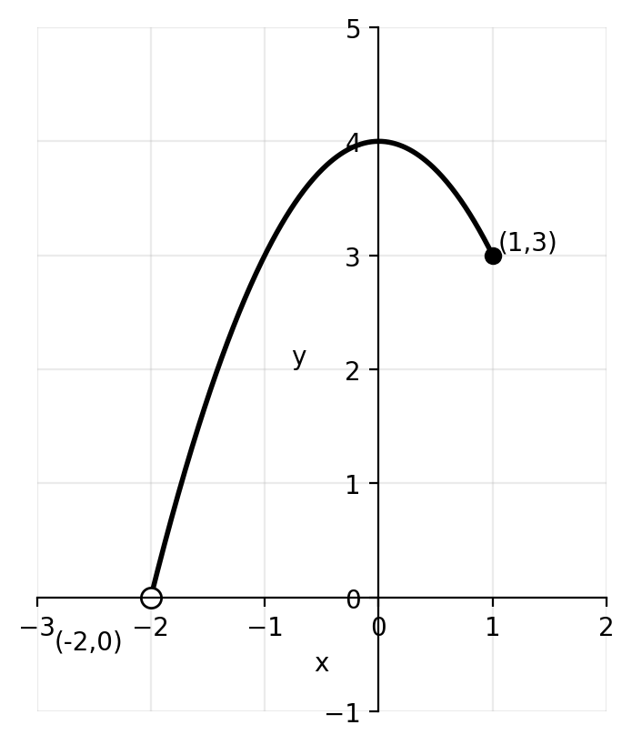
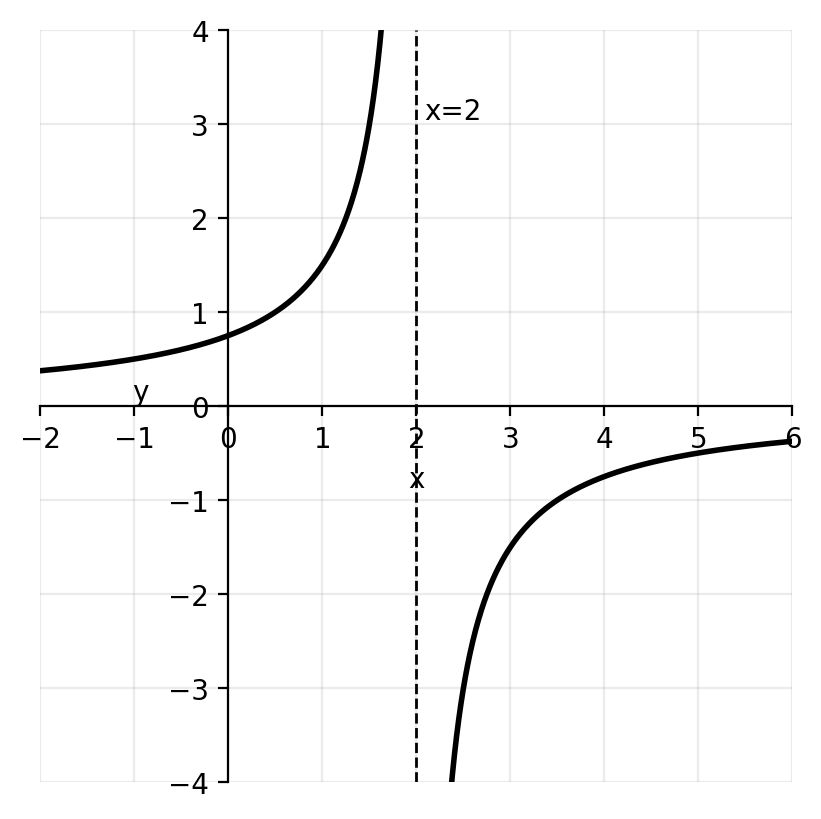
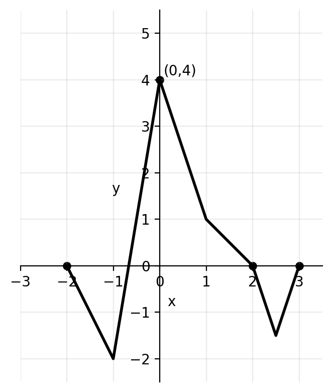

# Functions — Practice-Style 8 Questions

**Name:** ____________________  **Class:** _______  **Date:** __________  
**Time:** 20–30 minutes  
**Calculator:** Allowed

---

## Instructions
- Answer all questions.
- Show full working where appropriate.
- Leave exact answers unless told to round.
- Use correct mathematical notation.
- Keep your work organized using the question numbers.

---

## Quick formulas
- For \(y = \sqrt{\text{expression}}\), require \(\text{expression} \geq 0\)
- For \(y = \dfrac{1}{\text{expression}}\), require \(\text{expression} \neq 0\)
- For \(y = \dfrac{1}{\sqrt{\text{expression}}}\), require \(\text{expression} > 0\)
- A function has an inverse only if it is one-to-one on its stated domain

---

## Questions

**1.** Write down the domain and range of each graph.

**(a)**

The graph is a ray starting at the open point \((-4,-2)\) and going up to the right.

**(b)**

The graph is a downward-opening parabola with maximum point \((1.5,7)\).

**(c)**

The curve begins at the open point \((-2,0)\) and ends at the closed point \((1,3)\).

**(d)**

The graph has a vertical asymptote at \(x=2\) and a horizontal asymptote at \(y=0\).

---

**2.** Find the largest possible domain of each function.

**(a)** \( y = \sqrt{6x-7}+1 \)

**(b)** \( y = \dfrac{5x+3}{x-1} \)

**(c)** \( y = \dfrac{3}{\sqrt{4x-5}} \)

**(d)** \( y = \log_5(x+8) \)

---

**3.** You are given the function
\[
f(x) = -x^4 + 8x^2 - 3
\]
defined for \( 0 \leq x \leq 2 \).

Write down the range of \( f \).

---

**4.** Given \( f(x)=5x \) and \( g(x)=2x+1 \), write down the values of:

**(a)** \( f \circ g(2) \)

**(b)** \( g \circ f(3) \)

**(c)** \( g \circ g(1) \)

**(d)** \( f \circ g \circ f(-1) \)

---

**5.** Given \( f(x)=3x-7 \) and \( g(x)=\dfrac{x}{3}+5 \), find in simplest form:

**(a)** \( f \circ g(x) \)

**(b)** \( g \circ f(x) \)

**(c)** \( f \circ f(x) \)

---

**6.** Given \( f(x)=x-6 \) and \( g(x)=7x+14 \), find in the form \( ax+b \):

**(a)** \( f^{-1}(x) \)

**(b)** \( g^{-1}(x) \)

**(c)** \( f^{-1} \circ g^{-1}(x) \)

**(d)** \( g^{-1} \circ f^{-1}(x) \)

---

**7.** Consider the functions
\[
f(x)=2x^2-10x+17 \qquad \text{and} \qquad g(x)=x+2
\]

**(a)** Write down the largest possible domain and range of \( f(x) \).

**(b)** Let \( h(x)=f \circ g(x) \). Find an expression for \( h(x) \) in the form \( ax^2+bx+c \).

**(c)** Expand and simplify \( 2(x-3)^2+5 \).

**(d)** The domain of \( h(x) \) is now limited to \( x \geq a \) such that this function has an inverse. Write down the smallest possible value of \( a \).

**(e)** For the value of \( a \) found in part (d), find an expression for \( h^{-1}(x) \).

---

**8.** Let \( f(x)=2x+1 \). The graph of \( g(x) \) is shown below.

From the graph, \( g(0)=4 \), \( g(2)=0 \), and \( g(-2)=0 \).

Write down the value of:

**(a)** \( f \circ g(0) \)

**(b)** \( \sqrt{g \circ f(-1)} \)

---

# Answer Key

**1.**

**(a)**  \(D: x>-4\), \(R: y>-2\)

**(b)**  \(D: x \in \mathbb{R}\), \(R: y \leq 7\)

**(c)**  \(D: -2<x\leq 1\), \(R: 0<y\leq 3\)

**(d)**  \(D: x \neq 2\), \(R: y \neq 0\)

---

**2.**

**(a)**
\[
6x-7 \geq 0 \Rightarrow x \geq \frac{7}{6}
\]

**(b)**
\[
x-1 \neq 0 \Rightarrow x \neq 1
\]

**(c)**
\[
4x-5>0 \Rightarrow x>\frac{5}{4}
\]

**(d)**
\[
x+8>0 \Rightarrow x>-8
\]

---

**3.**
\[
f(0)=-3, \quad f(2)=13
\]
\[
f'(x)=-4x^3+16x=-4x(x^2-4)
\]
Critical values in the interval: \(x=0,2\)
So the range is
\[
-3 \leq f(x) \leq 13
\]

---

**4.**

**(a)**  \(g(2)=5\), so \(f(g(2))=25\)

**(b)**  \(f(3)=15\), so \(g(f(3))=31\)

**(c)**  \(g(1)=3\), then \(g(3)=7\)

**(d)**  \(f(-1)=-5\), then \(g(-5)=-9\), then \(f(-9)=-45\)

---

**5.**

**(a)**
\[
f \circ g(x)=3\left(\frac{x}{3}+5\right)-7=x+8
\]

**(b)**
\[
g \circ f(x)=\frac{3x-7}{3}+5=x+\frac{8}{3}
\]

**(c)**
\[
f \circ f(x)=3(3x-7)-7=9x-28
\]

---

**6.**

**(a)**  \(f^{-1}(x)=x+6\)

**(b)**  \(g^{-1}(x)=\dfrac{x-14}{7}=\dfrac{x}{7}-2\)

**(c)**
\[
f^{-1} \circ g^{-1}(x)=\frac{x}{7}+4
\]

**(d)**
\[
g^{-1} \circ f^{-1}(x)=\frac{x-8}{7}
\]

---

**7.**

**(a)**
\[
f(x)=2x^2-10x+17=2\left(x-\frac{5}{2}\right)^2+\frac{9}{2}
\]
Largest domain: \(x \in \mathbb{R}\)
\[
R: f(x) \geq \frac{9}{2}
\]

**(b)**
\[
h(x)=f(x+2)=2(x+2)^2-10(x+2)+17=2x^2-2x+5
\]

**(c)**
\[
2(x-3)^2+5=2x^2-12x+23
\]

**(d)**
\[
h(x)=2x^2-2x+5=2\left(x-\frac{1}{2}\right)^2+\frac{9}{2}
\]
So \(a=\frac{1}{2}\).

**(e)**
\[
y=2\left(x-\frac{1}{2}\right)^2+\frac{9}{2}
\]
\[
y-\frac{9}{2}=2\left(x-\frac{1}{2}\right)^2
\]
Since \(x \geq \frac{1}{2}\),
\[
x=\frac{1}{2}+\sqrt{\frac{y-\frac{9}{2}}{2}}
\]
Therefore
\[
h^{-1}(x)=\frac{1}{2}+\sqrt{\frac{x-\frac{9}{2}}{2}}
\]

---

**8.**

**(a)**
\[
f \circ g(0)=f(4)=9
\]

**(b)**
\[
f(-1)=-1, \quad g(-1)=-2
\]
Not defined over the real numbers since \(\sqrt{-2}\) is not real.
