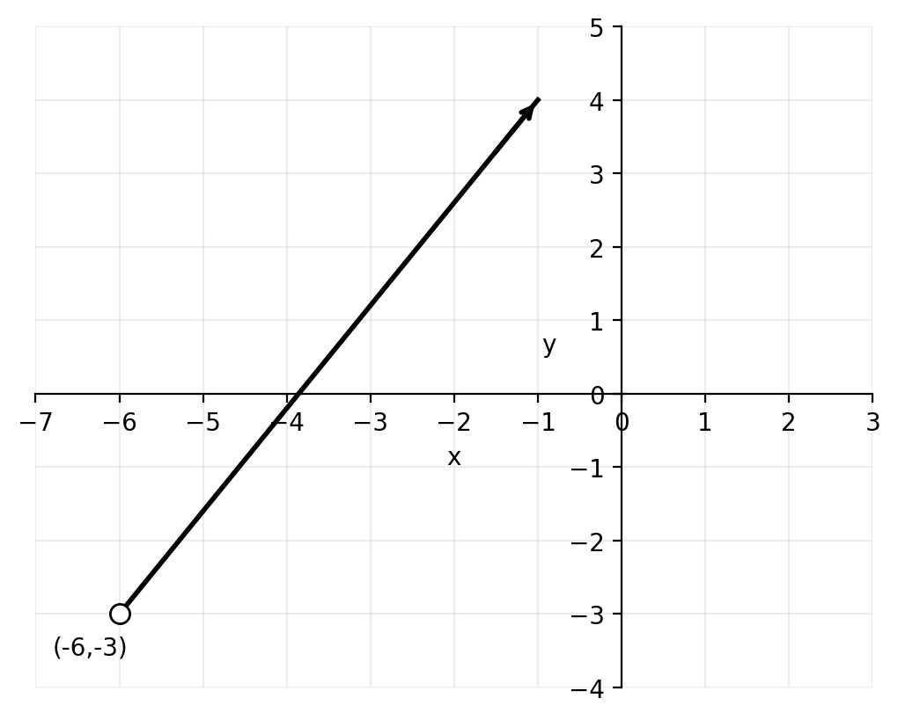
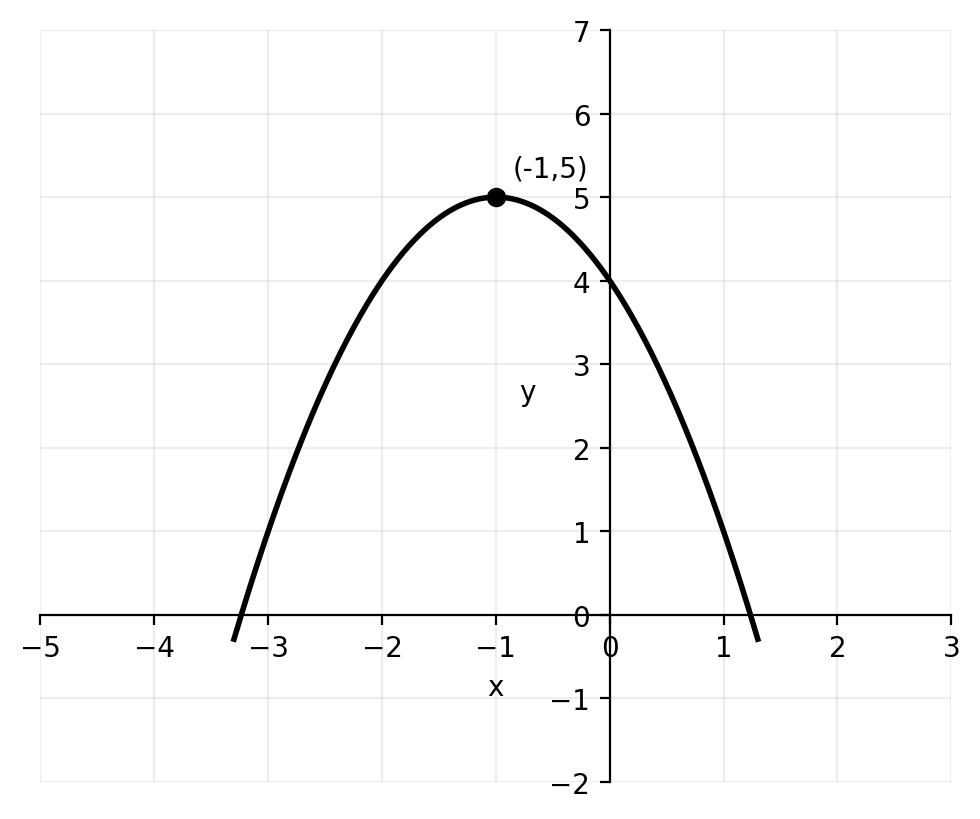
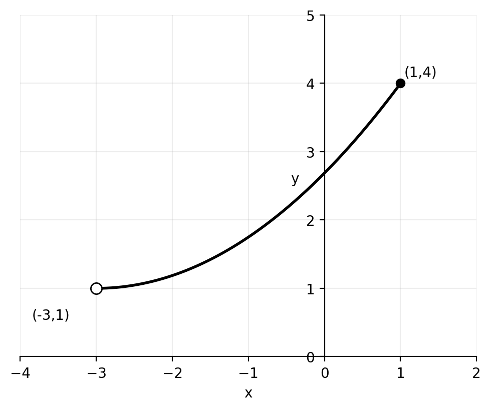
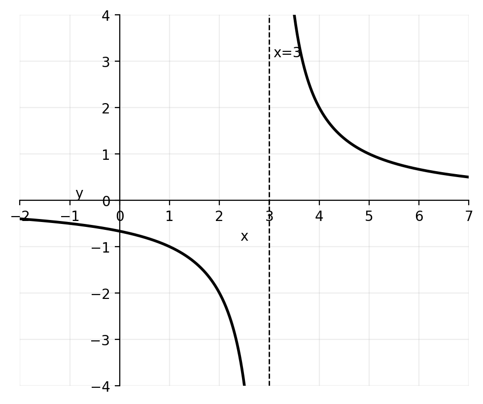
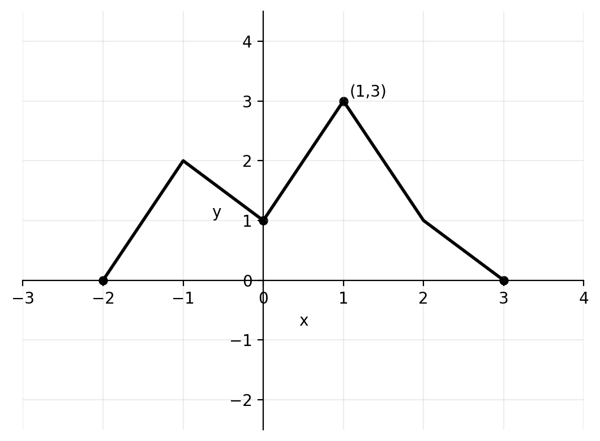

# Functions — Practice-Style 8 Questions

**Name:** ____________________  **Class:** _______  **Date:** __________  
**Time:** 20–30 minutes  
**Calculator:** Allowed

---

## Instructions
- Answer all questions.
- Show full working where appropriate.
- Leave exact answers unless told to round.
- Use correct mathematical notation.
- Keep your work organized using the question numbers.

---

## Quick formulas
- For \(y = \sqrt{\text{expression}}\), require \(\text{expression} \geq 0\)
- For \(y = \dfrac{1}{\text{expression}}\), require \(\text{expression} \neq 0\)
- For \(y = \dfrac{1}{\sqrt{\text{expression}}}\), require \(\text{expression} > 0\)
- A function has an inverse only if it is one-to-one on its stated domain

---

## Questions

**1.** Write down the domain and range of each graph.

**(a)**

The graph is a ray starting at the open point \((-6,-3)\) and going up to the right.

**(b)**

The graph is a downward-opening parabola with maximum point \((-1,5)\).

**(c)**

The curve begins at the open point \((-3,1)\) and ends at the closed point \((1,4)\).

**(d)**

The graph has a vertical asymptote at \(x=3\) and a horizontal asymptote at \(y=0\).

---

**2.** Find the largest possible domain of each function.

**(a)** \( y = \sqrt{8x-9}-2 \)

**(b)** \( y = \dfrac{6x-1}{x+3} \)

**(c)** \( y = \dfrac{4}{\sqrt{5x-6}} \)

**(d)** \( y = \log_3(x+10) \)

---

**3.** You are given the function
\[
f(x) = -x^4 + 6x^2 + 1
\]
defined for \( 0 \leq x \leq 2 \).

Write down the range of \( f \).

---

**4.** Given \( f(x)=2x+1 \) and \( g(x)=4x-3 \), write down the values of:

**(a)** \( f \circ g(2) \)

**(b)** \( g \circ f(1) \)

**(c)** \( g \circ g(0) \)

**(d)** \( f \circ g \circ f(-2) \)

---

**5.** Given \( f(x)=7x-2 \) and \( g(x)=\dfrac{x}{7}+1 \), find in simplest form:

**(a)** \( f \circ g(x) \)

**(b)** \( g \circ f(x) \)

**(c)** \( f \circ f(x) \)

---

**6.** Given \( f(x)=x+8 \) and \( g(x)=3x-9 \), find in the form \( ax+b \):

**(a)** \( f^{-1}(x) \)

**(b)** \( g^{-1}(x) \)

**(c)** \( f^{-1} \circ g^{-1}(x) \)

**(d)** \( g^{-1} \circ f^{-1}(x) \)

---

**7.** Consider the functions
\[
f(x)=x^2-8x+20 \qquad \text{and} \qquad g(x)=x+2
\]

**(a)** Write down the largest possible domain and range of \( f(x) \).

**(b)** Let \( h(x)=f \circ g(x) \). Find an expression for \( h(x) \) in the form \( ax^2+bx+c \).

**(c)** Expand and simplify \( (x-2)^2+4 \).

**(d)** The domain of \( h(x) \) is now limited to \( x \geq a \) such that this function has an inverse. Write down the smallest possible value of \( a \).

**(e)** For the value of \( a \) found in part (d), find an expression for \( h^{-1}(x) \).

---

**8.** Let \( f(x)=x+4 \). The graph of \( g(x) \) is shown below.

From the graph, \( g(1)=3 \), \( g(3)=0 \), and \( g(-2)=0 \).

Write down the value of:

**(a)** \( f \circ g(1) \)

**(b)** \( \sqrt{g \circ f(-4)} \)

---

# Answer Key

**1.**

**(a)**  \(D: x>-6\), \(R: y>-3\)

**(b)**  \(D: x \in \mathbb{R}\), \(R: y \leq 5\)

**(c)**  \(D: -3<x\leq 1\), \(R: 1<y\leq 4\)

**(d)**  \(D: x \neq 3\), \(R: y \neq 0\)

---

**2.**

**(a)**
\[
8x-9 \geq 0 \Rightarrow x \geq \frac{9}{8}
\]

**(b)**
\[
x+3 \neq 0 \Rightarrow x \neq -3
\]

**(c)**
\[
5x-6>0 \Rightarrow x>\frac{6}{5}
\]

**(d)**
\[
x+10>0 \Rightarrow x>-10
\]

---

**3.**
\[
f(0)=1, \quad f(2)=9
\]
\[
f'(x)=-4x^3+12x=-4x(x^2-3)
\]
Critical value in the interval: \(x=\sqrt{3}\)
\[
f(\sqrt{3})=10
\]
So the range is
\[
1 \leq f(x) \leq 10
\]

---

**4.**

**(a)**  \(g(2)=5\), so \(f(g(2))=11\)

**(b)**  \(f(1)=3\), so \(g(f(1))=9\)

**(c)**  \(g(0)=-3\), then \(g(-3)=-15\)

**(d)**  \(f(-2)=-3\), then \(g(-3)=-15\), then \(f(-15)=-29\)

---

**5.**

**(a)**
\[
f \circ g(x)=7\left(\frac{x}{7}+1\right)-2=x+5
\]

**(b)**
\[
g \circ f(x)=\frac{7x-2}{7}+1=x+\frac{5}{7}
\]

**(c)**
\[
f \circ f(x)=7(7x-2)-2=49x-16
\]

---

**6.**

**(a)**  \(f^{-1}(x)=x-8\)

**(b)**  \(g^{-1}(x)=\dfrac{x+9}{3}\)

**(c)**
\[
f^{-1} \circ g^{-1}(x)=\frac{x-15}{3}
\]

**(d)**
\[
g^{-1} \circ f^{-1}(x)=\frac{x+1}{3}
\]

---

**7.**

**(a)**
\[
f(x)=x^2-8x+20=(x-4)^2+4
\]
Largest domain: \(x \in \mathbb{R}\)
\[
R: f(x) \geq 4
\]

**(b)**
\[
h(x)=f(x+2)=(x+2)^2-8(x+2)+20=x^2-4x+8
\]

**(c)**
\[
(x-2)^2+4=x^2-4x+8
\]

**(d)**
\[
h(x)=x^2-4x+8=(x-2)^2+4
\]
So \(a=2\).

**(e)**
\[
y=(x-2)^2+4
\]
\[
y-4=(x-2)^2
\]
Since \(x \geq 2\),
\[
x=2+\sqrt{y-4}
\]
Therefore
\[
h^{-1}(x)=2+\sqrt{x-4}
\]

---

**8.**

**(a)**
\[
f \circ g(1)=f(3)=7
\]

**(b)**
\[
f(-4)=0, \quad g(0)=1, \quad \sqrt{g \circ f(-4)}=1
\]
